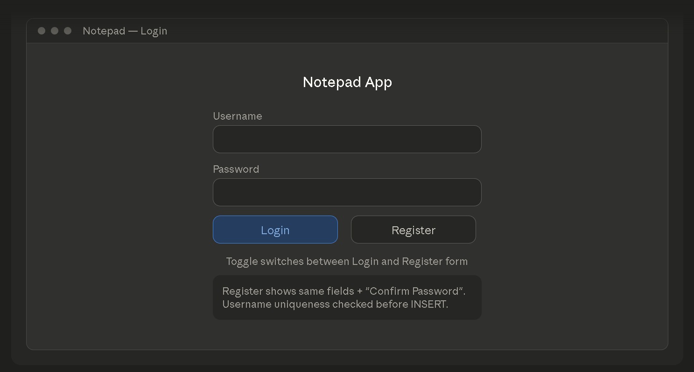
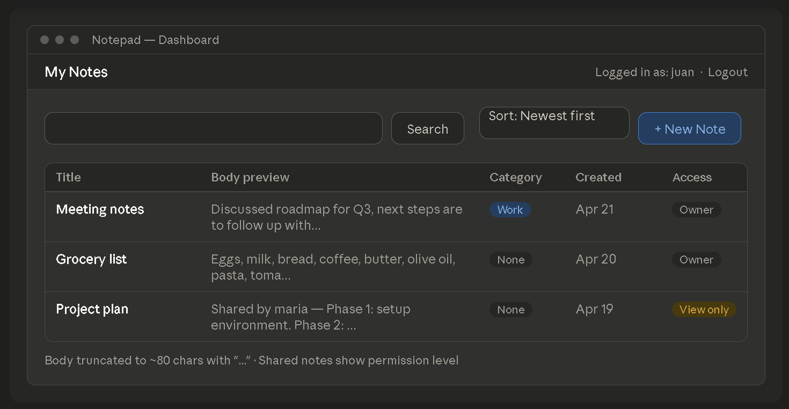
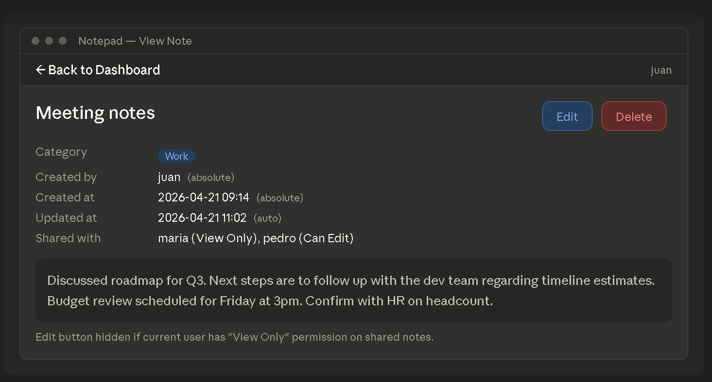
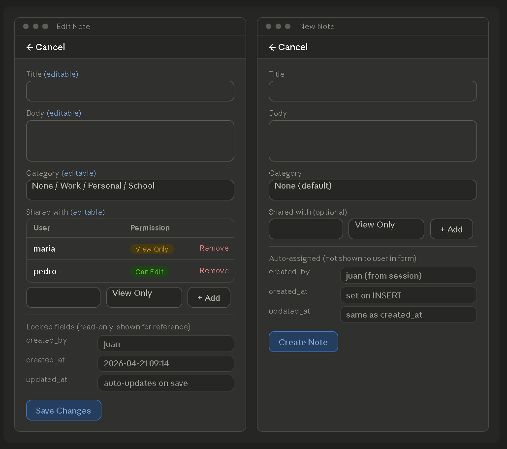
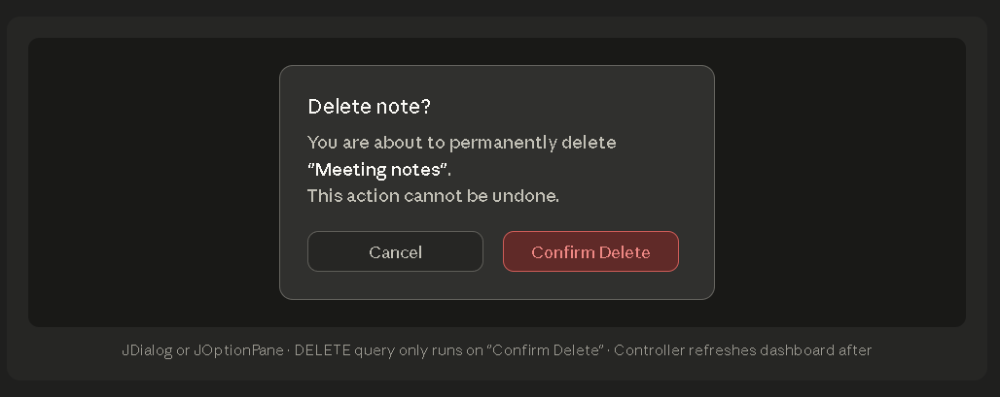

# Notepad

## OVERVIEW

> Create a fullstack Notepad Java ant+Swing UI with DB (SQL) application where user can login and register their own account, fully manage their notes with C.R.U.D. functionality.

## REQUIREMENTS
----------------
1. *Java Ant* + *Swing components*, *Netbeans* only (Students who use OS like **mac** or **linux** can use vscode if Netbeans is **NOT** available).
2. *MySQL* via *laragon* or *XAMPP*, connected to the UI (Java project) via Java DataBase Connection (JDCB).
3. Model, View, and Controller project architecture.
4. SQL DB table initialization with initialized user (username: admin | password: admin).

## INSTRUCTION
***Easy***

> ### Features:
- User account.
- Notes are only visible to the owner.
- Notes can an do full C.R.U.D.
- Each note must record:
    - When the note was created
- UI automatically refreshes upon mutation1 .
- Upon deleting, show a message dialog to confirm the deletion first before executing delete.

> ### Pages/Modals:
- Register
- Login
- Dashboard or Index Page
- Create Note
- View Note
- Edit Note

***Medium***

> ### Features:
- If the note body is greater than 50, trunctate2 the text then add "..."
- Notes are categorized (Note default category: None | category entry "None" in DB **MUST** be included in DB initialization).
- Note cannot have empty title and body at the same time.
- Upon creation or update, if either the title or the body is empty, show a message dialog to inform the user that the title or body is empty before executing the create or edit.

> ### Pages/Modals:
- Categories
- Category create, edit, and delete can be a popup modal3

***Hard***

> ### Features:
- Each note must record:
    - When the note was last updated
    - Who is the owner/creator
    - List of users the note was shared to and their permission
- Notes on Dashboard can be filtered with "Search" and "Sort" (Add textField for search and button for sort).
- Notes can be shared via "shared_with" and share permission can either be "View Only" or "Editor" (permission can be different on each users). 

> ### Pages/Modals:
- Share with user list and permission

## PAGES WIREFRAME

## DICTIONARY
1. Create, Update, and Delete
2. Text truncation is the process of shortening a string of text, typically by adding an ellipsis (...) to indicate that content has been cut off,
3. A modal popup is a design element that appears as a dialog box or window over the current page content.